  

   

  

    
    
    
    
  

 

### 👨‍💻 About Me

  
  
  
  

  

### 🚀 Current Focus
*<small>● Currently Learning & Building</small>*

  
  
  
  

 

### ⚙️ Technical Arsenal

  
<b>🌐 Frontend & UI</b>

   
  
  
  
  
  
  
  
  

  
<b>⚙️ Backend, Real-Time & Databases</b>

   
  
  
  
  
  
  
  
  
  

  
<b>🛠️ Tools, Platforms & Languages</b>

   
  
  
  
  
  
  
  
  
  
  

 

### 💼 Featured Projects

#### 🛒 [GharTak — Multi-Vendor E-Commerce](https://ghar-tak-ebon.vercel.app/)
Multi-vendor marketplace platform where sellers list products and buyers shop seamlessly.
- **Tech Stack:**      
- **Links:** [🌐 Live Demo](https://ghar-tak-ebon.vercel.app/)

 

#### 📹 [Vidora — Real-Time Video Conferencing](https://vidora-frontend-1.onrender.com/)
Real-time peer-to-peer video calling platform built for seamless communication.
- **Tech Stack:**     
- **Links:** [🌐 Live Demo](https://vidora-frontend-1.onrender.com/)

 

#### ✈️ [TripNest — Travel Booking Platform](https://tripnest-mxpc.onrender.com/listings)
A seamless platform to explore destinations, browse property listings, and book travel experiences.
- **Tech Stack:**      
- **Links:** [🌐 Live Demo](https://tripnest-mxpc.onrender.com/listings) | [📂 Repo](https://github.com/jeevan400/tripnest)

---

### 🏢 Professional Experience

**Software Development Intern** @ *Sensation Software Solutions*
- Translated Figma designs into pixel-accurate UIs for **Trace Venue**.
- Integrated REST APIs and implemented real-time features using `Socket.io` & `WebRTC`.

 

### 📊 GitHub Activity & Stats

  

  

 

<em>Code. Learn. Build. Repeat. 🚀</em>

